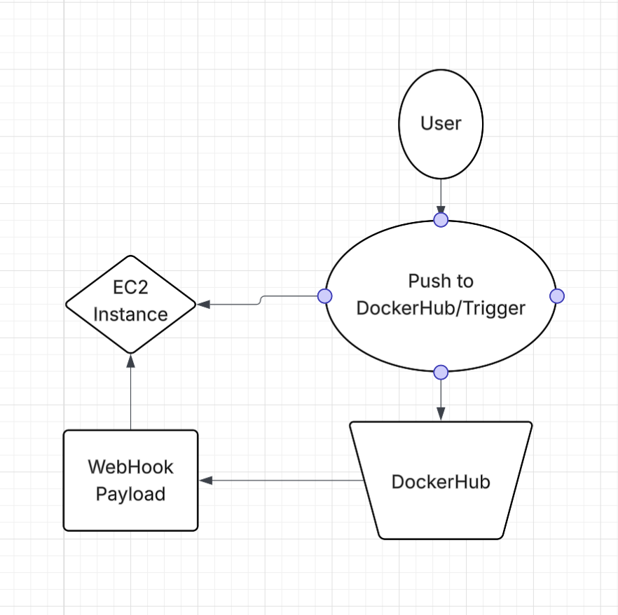

# Project 5

## Part 1 - Script a Refresh

### EC2 Instance Details
    - Ubuntu Server 24.04 LTS (HVM),EBS General Purpose (SSD) Volume Type.
    - t2.medium
    - 30 GB
    - For the security group I only allowed access from the IP range of 130.108.0.0/16. Which of course means anyone who is connected to the Wright State network can have a chance at ssh into my instance. I selected this because it makes it more secure than anyone from any IP rang having access. This in my mind is the perfect choice just becuause not everyone can have access but it's also not limited to just a singular IP. Also I added a rule that allows http on port 80 so I can check my website. It also is only for IP rnage of 130.108.0.0/16. All for the same reasons.

### Docker Setup on OS on the EC2 instance
    - The first thing I recommend is to run `sudo apt update` and `sudo apt upgrade`.
    - `sudo apt install docker.io` this installs docker.
    - `sudo systemct1 start docker`
    - `sudo systemct1 enable docker`
    - To verify that docker installed just run a simple command like `docker --version` or `docker ps` if there are no errors then it installed properly.

### Testing on EC2 Instance
    - `docker pull` I did `docker pull gordonsig/project3:latest`

    - `docker run -it --name project3-test -p 80:80 gordonsig?project3:latest` ok two run it you can use two diffrent flags, you could do `docker run -it` or `docker run -d` the 
    `-it` flag is for interaction and `-d` is for detached mode. Both prove to me that everything is running fine. When you run with `-it` it shows information like that apache and you are running it activly, while inside look up the public IP of your instance and you should see your website. For flag `-d` it runs in detached mode and it makes it where the container runs in the background and to check it you could run `docker ps`. I think the interactive mode is probably better for testing but both will work.

    - To verify the container is successfully serving the web application, first off I would do `docker ps` to see if the container is running. Then I would go to a webbrowser and type in the public IP of the instance and see if your wbsite comes up. This will tell you if it is working or not.

### Scripting Container Application Refresh
My bash script stops and removes the old container for the start. This is because if there is a container there you can't use the same name. After that it pulls the latest version of my Docker image. The last thing it does is run the new container in detached mode that also automatically restars and maps host port 80 to container port 80.

Before testing make sure your script is excutable (Took me a good minute to remember this) then run the script with something like `./refresh.sh` to check a container is running the easiest way is to `docker ps`

https://github.com/WSU-kduncan/cicdf25-Gordon-Sigler/blob/main/deployment/refresh.sh

## Part 2 - Listen
    - `sudo apt-get install webhook`
    - `webhook --version`
    
    Overall not to much going on in the definition file is I gave it the nsame project5-script. I have it executing to my bash script (refresh.sh). For the command-working-directory I just set it to the my home dierectory with /home/ubuntu. I set up a response message of Project 5 script should be working just so I know everything went properly. For my trigger-rule I made it a value with the secret Gandalf_The_Grey and made peramiter of a source header and the name Project5-Secret-hook.
    
    - To verify the definition file was loaded you can run a command like, `webhook -hooks /home/ubuntu/deployment/hooks.json -port 9000` if it starts up it means the your definition is good.
    
    - To check to see if the webhook is reciving payloads you can use `sudo journalctl -u webhook.service -f `
    
    - When running `docker ps` I would look to see that we got the lastest version, check the creation date and status time to have changed from before. This is because in the refresh.sh script it removes the old image and pulls the latest version. So if the times have changed to say seconds then you know it worked.

    https://github.com/WSU-kduncan/cicdf25-Gordon-Sigler/blob/main/deployment/definition

    - The service file  starts with After=network.target the purpose behind this is because it means that networking is available before the startup. The ExecStart is set up for my definition file and is listening on port 9000. Once again for WorkingDirectory I just went with home/ubuntu. I set the user as ubuntu just because it ensures that it will run with the correct permissions. I chose the multi-user in my install section because it makes it where multiple users can login and opperate at the same time (Also most of the examples I saw had this).

    - to enable and start you will want to use these three commands, `systemctl daemon-reload` this is like a refresh so it reads the definition again since you made it/changed it. Second `systemctl enable webhook.service` then lastly `systemctl start webhook.service`

    - To verify just run `systemctl status webhook.service` and it should show enabled and active.

    https://github.com/WSU-kduncan/cicdf25-Gordon-Sigler/blob/main/deployment/service

## Part 3 - Send a Payload
    - I chose DockerHub as the payload sender just because it gives you the clearest understanding of if your webhook is working or not, because using DockerHub compared to GitHub

    - To enable DockerHub to send a payload you
        -login to DockerHub
        - Go to repositories
        - Go to webhooks
        - Then name the webhook and paste in EC2 webhook URL that was set up in part 2
        - The trigger is when a push is made to DockerHub.
        - To verify with checking that a container named project3 is running, check the created/status date.

## Part 4 - Project Description & Diagram

The goal of this project is to make an automated continous deployment pipleine. This pipeline would ensure that users would have the latest version of a Docker container we had previously made. This new container would be on an EC2 instance without any manual assientce needed.

Tools:
    - EC2 Instance: This is the application server that runs the container and where the deployment of the webhooks should happen.

    - DockerHub: DockerHub is what sneds the payload once a trigger happends like a new image is built/new tag is created.

    - adnanh/webhook: This is what would recieve the payloads and cause the script made to run causing the old image to be removed and the newest image to be pulled onto the EC2 instance.

### Sources

Okay I do have to admit I asked chatgpt for help on verifiying that the webhook was reciving payloads. I specifically asked "how would someone verify that a webhook payload is received" and it gave me the response of `sudo journalctl -u webhook.service -f
` It just explained that it showed realtime output of each received payload. I don't like using chatGPT or any AI but I was struggling with this assignment and trying to race the clock I couldn't think of how to do this part so I caved in and asked.

https://docs.redhat.com/en/documentation/red_hat_enterprise_linux/9/html/using_systemd_unit_files_to_customize_and_optimize_your_system/assembly_working-with-systemd-unit-files_working-with-systemd

I used ths for help with the systemctl commands, mainly remembering systemctl daemon-reload and what it does and why it is important.

I did also rewatch the lecture for the part on setting up the webhook on DockerHub I don't even know if that is worth mentioning but I thought I should just in case.

https://docs.gitlab.com/user/project/integrations/webhooks/

This helped with better understanding webhook and gave some examples of what to look for. Definetly not the best but just helped with understanding.

I did ask google for some commands or say for example what are the diffrent install options in a service systemctl and gemini would give me answers. But overall nothing to crazy. I hope that is also fine.