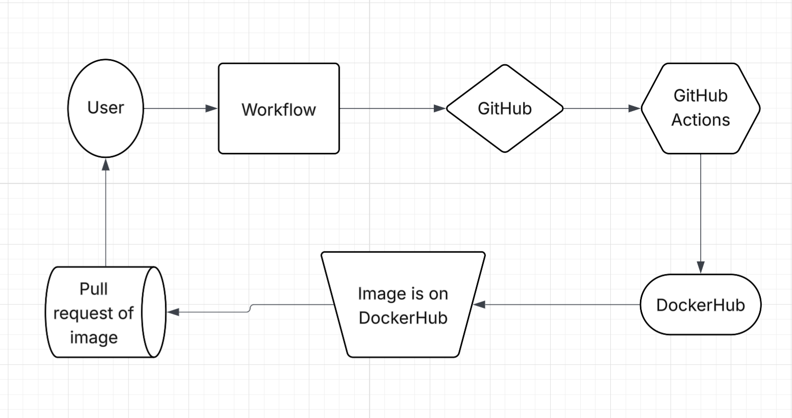

# Project 4

## Continuous Integration Project Overview

The goal of this project is to set up an automated system that takes a few HTML files and builds them into a Docker image. This image is updated every time a new version tag is created, making it easy to track changes, rebuild, or build off different versions. 

The continous Intergration pipeline workflow triggers when a tag is pushed. The next tool is GitHub Actions which handles checking the code and making sure everything is good to go. It also makes the version tags then sends it out to DockerHub where the image is built. Now this image can be pulled and ran.



## Part 1: Creating Docker Image
The website is an old project I have from Web Development 1, and the content is an index that is a list of my classes in the form of a schedule. The second HTML file is a how-to contact page.

https://github.com/WSU-kduncan/cicdf25-Gordon-Sigler/blob/main/web-content/index.html

https://github.com/WSU-kduncan/cicdf25-Gordon-Sigler/blob/main/web-content/contact.html

The DockerFile uses httpd: 2.4. The image makes it so that your website files are placed in the correct directory.

https://github.com/WSU-kduncan/ceg3120f25-Gordon-Sigler/blob/main/Projects/Project3/Dockerfile

To build a docker image you would run the command docker build -t (then dockerhub username) / (the image name): (whatever you want here I did first because it was my first version) -f Dockerfile (the path to the dockerfile or . is for current directory)

example: `docker build -t gordonsig/project3:first -f Dockerfile .`

To run a container that serves the web application from the the image Dockerfile built you will need to run a docker run command. For example if I wanted to run the container in detached mode I would do something like this:

`docker run -d -p 8080:80 gordonsig/project3:first`

Of course you can change the ports or if you don't want detached mode remove the -d flag. But overall that is how you will run a docker container.

### Workflow

#### Configuring GitHub Repository Secrets
To make a PAT token you will:
```
    go to dockerhub.com
    sign into to your acccount
    Open the menu and hit settings
    Press Personal Acess Tokens
    Then generate new token
```
For scope it depends on the circumstances in the case for the project I went with Read, Write, Delete, because I want full control.

To set secretes while in your repository:
```
Press the three dot button
Click settings
Click Secrets and Variables then Actions
Press New Repository Secret
```
The secrets for this project are the DOCKER_USERNAME which contains the username for DockerHub.

The other secret is DOCKER_TOKEN which contains the personal access token for DockerHub.

#### CI with GitHub Actions

The workflow trigger looks like this:

```
on:
  push:
      branches:
         - main
```
This means that this workflow only triggers when commits are pushed on the main branch.

The workflow steps section looks like this:

```
steps:
          - name: Checkout
            uses: actions/checkout@v3


          - name: Login with secrets
            uses: docker/login-action@v2
            with:
                username: ${{ secrets.DOCKER_USERNAME }}
                password: ${{ secrets.DOCKER_TOKEN }}


          - name: Build/Push
            uses: docker/build-push-action@v5
            with:
               context: .
               push: true
               tags: gordonsig/project3:first
```

The checkout section with  `uses: actions/checkout@v3` makes the repository available to the workflow so it can access the Dockfile and build an image.

The next use is `docker/login-action@v2`. This allows you to login to docker using the username and password.

The last use is `docker/build-push-action@v5`. This makes it where the container image is built from the repository and pushed to DockerHub.

For changes that you will need to make if using a diffrent repository:

The first change you would need to make would be to the name. The name should match the project or thing you are working on.

The second change would be the GitHub secrets, in this repository it's for a specific username and token. When using a diffrent repository these secretes will have to be added or changed.

The third change you would have to do is the image tag. It should be changed to whatever you are currently working on.

The foruth change would be to if you want to keep the trigger. Right now it is set to when a push is made on main. Someone might not want that or might have a diffrent branch that they want to cause the trigger.

https://github.com/WSU-kduncan/cicdf25-Gordon-Sigler/blob/main/.github/workflows/project4.yml

#### Testing & Validating

How to test the workflow? One way to test would be to make a push to the main branch this will trigger the workflow. Go to the actions tab in the repository and see if it was successful or if it had a error.

How to verify that the image in DockerHub works when a container is run using the image? The best way to test this in my mind would be to pull the image first. The run the container and try to reach the website and see if it works or not.

https://hub.docker.com/r/gordonsig/project3

## Part 3 - Semantic Versioning

#### Generating tags

To see tags in a git repository use the command `git tag`. While on GitHub under the code section and next to branch is a tag tab where you can see tags.

To generate a tag in a git repository use the command `git tag` For example `git tag -a v1.0.0`.

To push a tag you would use the command `git push` command. For example I did `git push origin v1.0.2`

#### Semantic Versioning Container Images with GitHub Actions

The workflow trigger looks like this:
```
on:
  push:
      tags:
         - "v*.*.*"
```

This works when tag is pushed matching the form of v*.*.* for example you could push something like this tag v1.0.1


The workflow steps look like this:
```
steps:
          - name: Checkout
            uses: actions/checkout@v3

          - name: generate tags
            id: meta
            uses: docker/metadata-action@v5
            with:
              images: gordonsig/project3
              tags: |
                type=semver,pattern={{version}}
                type=semver,pattern={{major}}
                type=semver,pattern={{major}}.{{minor}}

          - name: Login with secrets
            uses: docker/login-action@v2
            with:
                username: ${{ secrets.DOCKER_USERNAME }}
                password: ${{ secrets.DOCKER_TOKEN }}


          - name: Build/Push
            uses: docker/build-push-action@v5
            with:
               context: .
               push: true
               tags: ${{ steps.meta.outputs.tags }}
               labels: ${{ steps.meta.outputs.labels }}
```

The checkout section with  `uses: actions/checkout@v3` makes the repository available to the workflow so it can access the Dockfile and build an image.

`docker/metadata-action@v5` is sued to create the major.minor.patch.

The next use is `docker/login-action@v2`. This allows you to login to docker using the username and password.

The last use is `docker/build-push-action@v5`. This makes it where the container image is built from the repository pushed to DockerHub with all the tags.

https://github.com/WSU-kduncan/cicdf25-Gordon-Sigler/blob/main/.github/workflows/project4.yml

#### Testing & Validating

After pushing my tags I went to the GitHub Actions tab to ensure it was successful. After that I went to DockerHub and checked the tag history and current tag to see if it had changed. If the version was diffrent it proved it worked.

I would say for diffrences it would have to be the same as before. Things like the image name, Secret information, the trigger, all that would have to be changed to fit someones style or requirements.

To check I pulled the most recent version of the Image I had created. After the  pull I ran the container then check to see that it was running. This would ensure that I could get the image and get it going.

https://hub.docker.com/repository/docker/gordonsig/project3/general


## Resources Section

https://docs.docker.com/build/ci/github-actions/manage-tags-labels/

Really good example of how to use tags inside of the workflow. Very useful for part 3.

https://github.com/docker/metadata-action?tab=readme-ov-file#semver

Helped explain the metadata-action to generate a set of tags.

https://github.com/docker/login-action

This was great for showing how to use the secrets in the workflow to login to DockerHub.

https://github.com/docker/build-push-action

This was super helpfull with the Build and Push section of the workflow. It just gave an overall walk through and a bunch of useful information.
